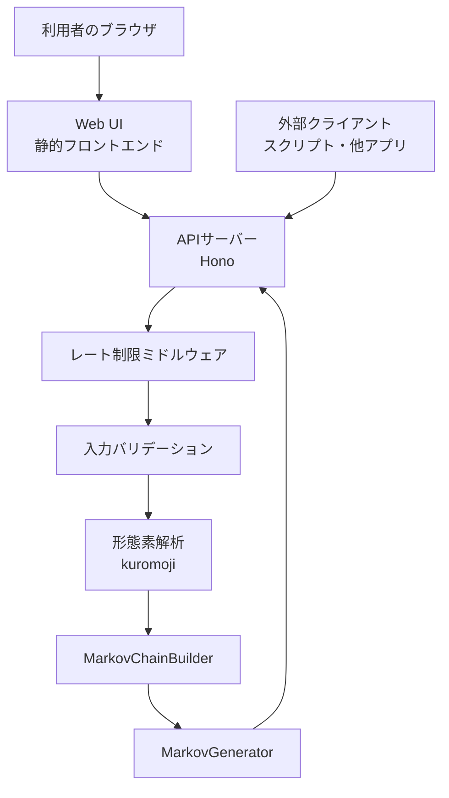
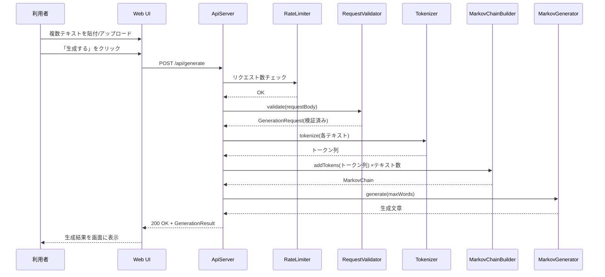
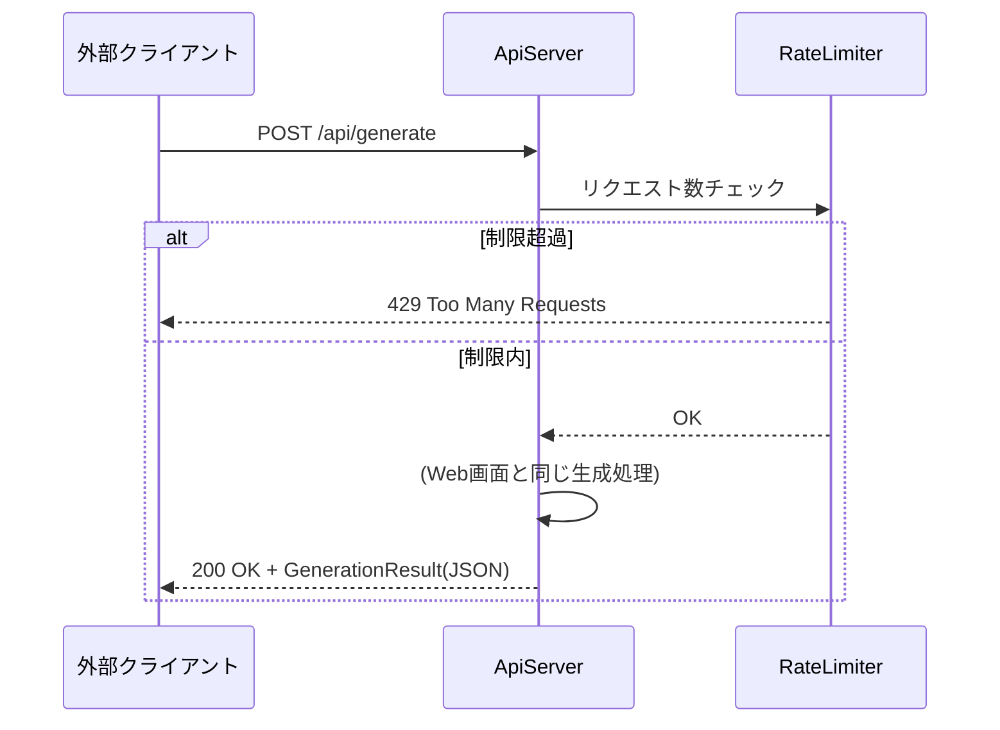
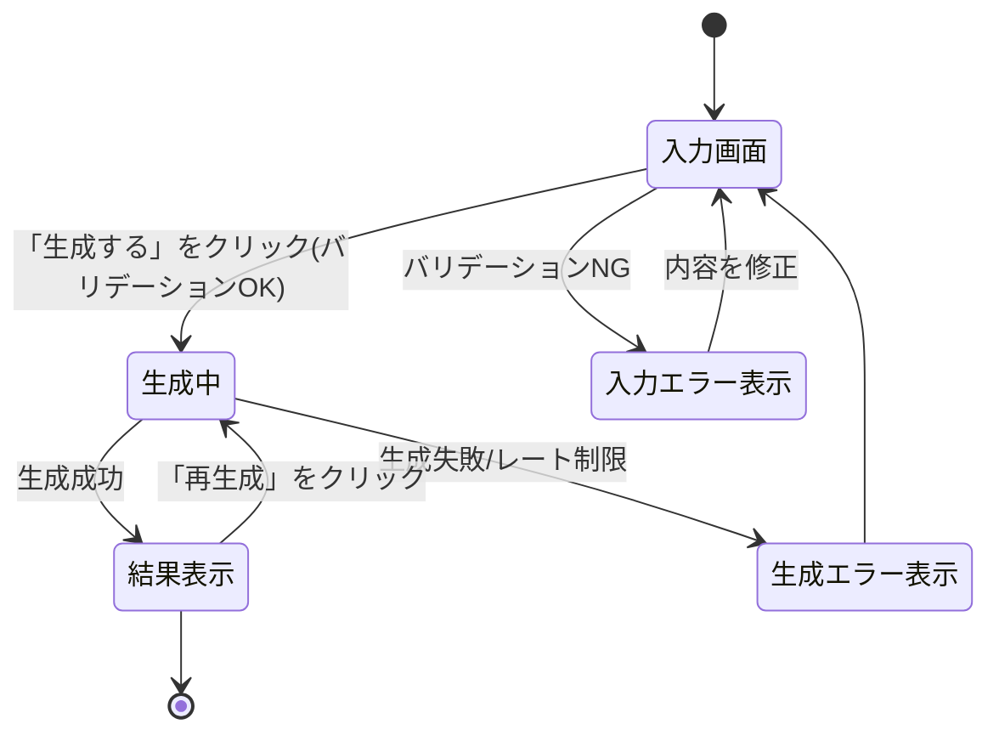

# 機能設計書 (Functional Design Document)

## システム構成図



Web UIとAPI直接呼び出しは同一のAPIサーバー(`POST /api/generate`)を経由する。永続化層は持たない(生成結果を保存しない要件のため)。

## 技術スタック

| 分類 | 技術 | 選定理由 |
|------|------|----------|
| 言語 | TypeScript | 既存のプロジェクト設定(tsconfig.json/eslint/vitest)がTypeScript前提で構築済み |
| フレームワーク | Hono | モダンで軽量、Node.js以外のランタイムへの移行余地もある |
| ランタイム | Node.js | 現時点でのデプロイのしやすさを優先 |
| 形態素解析 | kuromoji | 純粋JavaScript実装で、MeCab等のネイティブバイナリ・辞書インストールが不要 |
| データベース | なし | 入力・生成結果を永続化しない要件のため不要 |
| バリデーション | zod | `GenerationRequest`のスキーマ検証(RequestValidatorを参照) |
| レート制限 | ミドルウェア(例: 送信元IP単位のトークンバケット) | 認証なし公開APIの濫用防止(PRD非機能要件) |
| テスト | Vitest | 既存プロジェクトに導入済み |

## データモデル定義

生成結果を永続化しないため、DBエンティティは存在しない。代わりにAPIのリクエスト/レスポンス型を定義する。

```typescript
interface GenerationRequest {
  texts: string[];          // 元テキスト(1件以上)。1件あたり10万字、合計30万字まで
  maxWords?: number;        // 生成する文章の語数上限。デフォルト: 1000
  chainLength?: number;     // マーコフ連鎖の長さ(直前何単語を考慮するか)。デフォルト: 2
}

interface GenerationResult {
  text: string;             // 生成された文章
  wordCount: number;        // 実際に生成された語数
}

interface GenerationError {
  error: string;            // エラー種別(例: "validation_error", "rate_limited")
  message: string;          // 利用者向けエラーメッセージ
}
```

**制約**:
- `texts`は要素数1以上、各要素は1〜100,000文字、合計300,000文字以内
- `maxWords`は1〜5000の範囲(上限はサーバー負荷を考慮した仮の値)
- `chainLength`は1〜5の範囲(仮の値。極端に大きい値は元テキストと同一の文章を出力しやすくなるため上限を設ける)

### ER図

該当なし(永続化するデータを持たないため作成しない)。

## コンポーネント設計

### ApiServer(Hono)

**責務**:
- HTTPリクエストの受付とルーティング(`POST /api/generate`)
- レート制限ミドルウェアの適用
- `RequestValidator`・各コンポーネントの呼び出し、および`ValidationError`/`RateLimitError`等の例外を対応するHTTPステータス(400/429等)に変換してレスポンスを返す(`docs/development-guidelines.md`のエラーハンドリング方針に準拠)

**インターフェース**:
```typescript
class ApiServer {
  // リクエストボディの検証(RequestValidator呼び出し)から生成までを行い、
  // ValidationError/RateLimitError等は呼び出し元(ルートハンドラ)でcatchしHTTPステータスに変換する
  handleGenerate(requestBody: unknown): Promise<GenerationResult>;
}
```

**依存関係**:
- RateLimiter
- RequestValidator
- Tokenizer
- MarkovChainBuilder / MarkovGenerator

### RequestValidator

**責務**:
- リクエストボディをzodスキーマで検証し、`GenerationRequest`型として解釈できることを確認する(型変換・必須項目の欠落チェック)
- `texts`の件数・文字数上限、`maxWords`・`chainLength`の範囲など、zodスキーマだけでは表現しにくいビジネスルールを追加でチェックする
- 不正な場合は`ValidationError`をスローする(`docs/development-guidelines.md`のエラーハンドリング方針、`docs/glossary.md`の`ValidationError`定義に準拠)

**インターフェース**:
```typescript
import { z } from 'zod';

const generationRequestSchema = z.object({
  texts: z.array(z.string().min(1).max(100_000)).min(1),
  maxWords: z.number().int().min(1).max(5000).optional(),
  chainLength: z.number().int().min(1).max(5).optional(),
});

class RequestValidator {
  // zodスキーマでの検証+ 合計文字数など複合条件のチェックを行う
  // 不正な場合はValidationErrorをスローする
  validate(body: unknown): GenerationRequest;
}
```

**依存関係**: zod

### Tokenizer

**責務**:
- kuromojiを用いて日本語テキストを単語単位に分割する
- 辞書の読み込みはサーバー起動時に一度だけ行い、リクエストごとの読み込みは行わない(パフォーマンス最適化を参照)

**インターフェース**:
```typescript
class Tokenizer {
  // サーバー起動時に一度だけ呼び出し、辞書を読み込む
  static initialize(): Promise<Tokenizer>;

  // テキストを単語配列に分割する
  tokenize(text: string): string[];
}
```

**依存関係**: kuromoji

### MarkovChainBuilder

**責務**:
- 複数テキストのトークン列を1つのマーコフ連鎖モデルに統合して学習する
- 参考実装(`docs/ideas/reference/markov.rb`)の連鎖構築ロジックをTypeScriptに移植する

**インターフェース**:
```typescript
type MarkovChain = Map<string, string[]>; // 状態キー(直前n単語の連結) -> 続く単語の候補リスト

class MarkovChainBuilder {
  constructor(chainLength: number);

  // 複数テキストのトークン列を追加学習する
  addTokens(tokens: string[]): void;

  build(): MarkovChain;
}
```

**依存関係**: なし

### MarkovGenerator

**責務**:
- 学習済みのマーコフ連鎖から新しい文章を生成する
- `maxWords`に達するか、終端記号に到達したら生成を終了する

**インターフェース**:
```typescript
class MarkovGenerator {
  constructor(chain: MarkovChain, chainLength: number);

  generate(maxWords: number): string;
}
```

**依存関係**: なし

### RateLimiter(ミドルウェア)

**責務**:
- 送信元(IPアドレス)ごとにリクエスト数を計測し、一定数を超えたら429を返す

**インターフェース**:
```typescript
class RateLimiter {
  middleware(): HonoMiddleware;
}
```

**依存関係**: なし(サーバープロセス内のメモリ上でカウント。将来的な複数インスタンス構成では外部ストア(Redis等)への置き換えを検討)

## ユースケース図

### Web画面からの文章生成



### 外部APIからの直接呼び出し



**フロー説明**:
1. 外部クライアントもWeb画面と全く同じエンドポイント・処理を経由する
2. レート制限はWeb画面からのリクエストにも同様に適用される(送信元単位のため)

## 画面遷移図



## API設計

### 文章生成

```
POST /api/generate
```

**リクエストヘッダー**:
| ヘッダー | 必須 | 説明 |
|---------|------|------|
| `X-Session-Id` | 任意(Web UIは常に付与) | `docs/glossary.md`で定義する「セッション」ID。Web UIがページ読み込み時に`crypto.randomUUID()`等で生成し、以降の`/api/generate`呼び出しに同じ値を付与する。外部クライアントが省略した場合、そのリクエストはセッション集計の対象外として扱う |

**リクエスト**:
```json
{
  "texts": ["元テキスト1...", "元テキスト2..."],
  "maxWords": 1000,
  "chainLength": 2
}
```

**レスポンス**:
```json
{
  "text": "生成された文章...",
  "wordCount": 842
}
```

**エラーレスポンス**:
- 400 Bad Request: `texts`が0件、文字数上限超過、`maxWords`/`chainLength`が範囲外
- 413 Payload Too Large: リクエストボディが上限サイズを超過
- 429 Too Many Requests: 送信元からのリクエストがレート制限を超過
- 500 Internal Server Error: 形態素解析・生成処理中の予期しないエラー

### APIドキュメント

`GET /api/docs` でリクエスト/レスポンス仕様を公開する(PRDの「API仕様のドキュメント公開」要件に対応)。

## アルゴリズム設計

### マーコフ連鎖による文章生成

**目的**: 複数の元テキストを1つのマーコフ連鎖モデルとして学習し、そこから新しい文章をランダムに生成する。参考実装(`docs/ideas/reference/markov.rb`)のロジックをTypeScriptに移植する。

**計算ロジック**:

#### ステップ1: 形態素解析
- kuromojiで各元テキストを単語単位に分割する
- 各テキストのトークン列の先頭に`chainLength`個、末尾に1個の終端記号(NONWORD、`docs/glossary.md`を参照)を追加し、テキストの境界を連鎖上でも区別する

#### ステップ2: 連鎖の構築
- 直前`chainLength`個の単語を状態キーとし、状態キーごとに「次に出現しうる単語のリスト」を蓄積する
- 複数テキストのトークン列を順に同じ連鎖モデルに追加することで、テキスト間をまたいだ単語のつながりが生まれる

```typescript
// NONWORDはkuromojiのトークンと衝突しない予約値とする(docs/glossary.mdを参照)
const NONWORD = '\n';

function buildChain(tokenLists: string[][], chainLength: number): MarkovChain {
  const chain: MarkovChain = new Map();
  for (const tokens of tokenLists) {
    const padded = [...Array(chainLength).fill(NONWORD), ...tokens, NONWORD];
    for (let i = 0; i <= padded.length - chainLength - 1; i++) {
      const key = padded.slice(i, i + chainLength).join('');
      const next = padded[i + chainLength];
      const candidates = chain.get(key) ?? [];
      candidates.push(next);
      chain.set(key, candidates);
    }
  }
  return chain;
}
```

#### ステップ3: 文章生成
- 状態を終端記号で初期化し、状態キーに対応する候補からランダムに1つ選んで出力する
- 選んだ単語で状態を更新し、終端記号が出るか`maxWords`に達するまで繰り返す

```typescript
function generate(chain: MarkovChain, chainLength: number, maxWords: number): string {
  let state = Array(chainLength).fill(NONWORD);
  const result: string[] = [];

  for (let i = 0; i < maxWords; i++) {
    const key = state.join('');
    const candidates = chain.get(key);
    if (!candidates || candidates.length === 0) break;

    const next = candidates[Math.floor(Math.random() * candidates.length)];
    if (next === NONWORD) break;

    result.push(next);
    state = [...state.slice(1), next];
  }

  return result.join('');
}
```

**参考実装との違い**:
- 参考実装(`markov.rb`)は単一テキスト・単一のグローバル状態を前提としていたが、複数テキストを1モデルに統合するため、テキストごとに連鎖をパディングして境界を明示する
- 参考実装は生成語数の上限がコード内に固定値(1000)で埋め込まれていたが、本設計では`maxWords`としてリクエストごとに指定可能にする

## UI設計

### 入力画面

**表示項目**:
| 項目 | 説明 | フォーマット |
|------|------|-------------|
| テキスト入力欄 | 元テキストを貼り付ける複数のテキストエリア(「追加」で欄を増やせる) | 複数行テキストエリア |
| ファイルアップロード | `.txt`ファイルを複数選択してアップロード | ファイル選択 + アップロード後のプレビュー表示 |
| 生成パラメータ(任意設定) | 語数上限・連鎖の長さ | 数値入力(デフォルト値を表示) |
| 生成ボタン | クリックで生成を開始 | ボタン |

### インタラクティブモード

**操作フロー**:
0. ページ読み込み時、Web UIがセッションID(`X-Session-Id`)を1つ発行し、以降このページを離れるまでの`/api/generate`呼び出しに付与する
1. テキストエリアに貼り付け、または`.txt`ファイルをアップロードする(アップロード後、内容がプレビュー表示される)
2. 「テキストを追加」で入力欄を増やし、2つ目以降の元テキストを入力する
3. 必要であれば生成パラメータを調整する(未指定時はデフォルト値を使用)
4. 「生成する」をクリックすると、ローディング表示の後に生成結果が画面内に表示される
5. 「再生成」で同じ入力のまま新しい結果を得られる。「結果をコピー」でクリップボードにコピーできる

## パフォーマンス最適化

- kuromojiの辞書読み込みはサーバー起動時に一度だけ行い、`Tokenizer`インスタンスをリクエスト間で再利用する(辞書読み込みはリクエストごとに行うと数秒単位の遅延要因になるため)
- マーコフ連鎖の構築はリクエストごとに行うが、対象テキストが合計30万字以内であるため、PRDのKPI(10万字以内は5秒以内、10万字超〜30万字以内は10秒以内)を目安に許容範囲かを実装後に計測する

## セキュリティ考慮事項

- アップロードファイルはWeb UI側で`File.text()`によりテキストとして読み込んでからAPIに送信するため、APIサーバーには文字列(`texts: string[]`)のみが渡り、拡張子・MIMEタイプはサーバーに渡らない。文字数上限(1件あたり10万字)は`RequestValidator`が貼り付けテキストと同じ基準で検証する(`docs/architecture.md`のサニタイゼーション方針を参照)
- リクエストボディサイズの上限をHonoのミドルウェアレベルでも設定し、413を返す
- 送信元IP単位のレート制限により、公開API・Web画面双方の濫用を防ぐ。閾値は仮に「1 IPアドレスあたり1分間に10リクエストまで」とし、実運用のアクセス状況を見て調整する
- 入力・生成結果はメモリ上でのみ扱い、リクエスト処理完了後は保持しない
- PRDのKPI測定のため、リクエスト数・成否・処理時間・セッションID単位のリクエスト回数などの匿名集計指標のみをログとして記録する。元テキストや生成結果の内容、利用者を特定できる情報は記録しない(詳細はアーキテクチャ設計書のデータ永続化戦略を参照)。セッションIDはWeb UIが発行する一時的な値であり、利用者個人の識別には利用しない

## エラーハンドリング

### エラーの分類

| エラー種別 | 処理 | ユーザーへの表示 |
|-----------|------|-----------------|
| 入力バリデーションエラー(件数・文字数・パラメータ範囲) | 400を返し処理を中断 | "元テキストを1件以上入力してください"等、具体的な条件を提示 |
| ファイルサイズ超過 | 413を返し処理を中断 | "アップロードできるファイルサイズを超えています" |
| レート制限超過 | 429を返し処理を中断 | "リクエストが多すぎます。しばらく待ってから再度お試しください" |
| 形態素解析・生成処理の予期しないエラー | 500を返し処理を中断、詳細はログにのみ出力 | "生成中にエラーが発生しました。時間をおいて再度お試しください" |

## テスト戦略

### ユニットテスト
- `RequestValidator`: 境界値(文字数上限ちょうど・超過、`texts`が0件/1件/複数件)
- `MarkovChainBuilder` / `generate`: 既知の小さな入力に対する連鎖構築・生成ロジックの検証
- `Tokenizer`: 既知の日本語文に対するトークン分割結果の検証

### 統合テスト
- `POST /api/generate`への正常系リクエスト(複数テキスト)と各種異常系リクエスト(件数不足・文字数超過・パラメータ範囲外)
- レート制限が指定回数を超えた際に429を返すこと

### E2Eテスト
- テキストエリア入力→生成→結果表示の一連の操作
- ファイルアップロード→プレビュー表示→生成の一連の操作
